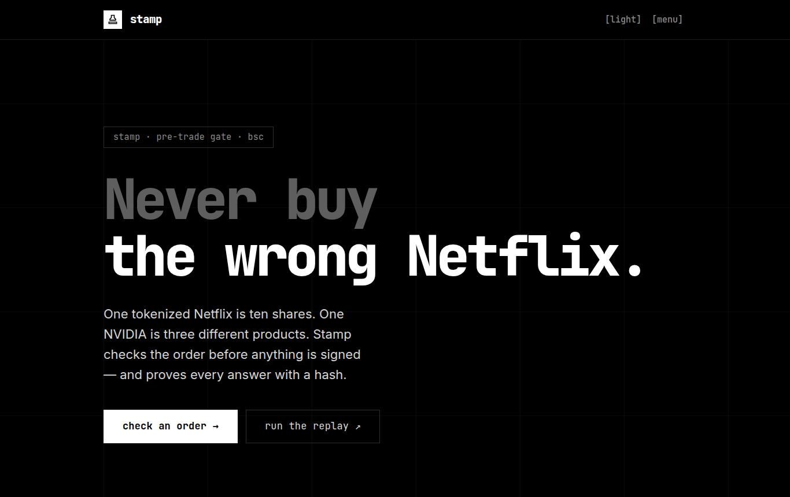
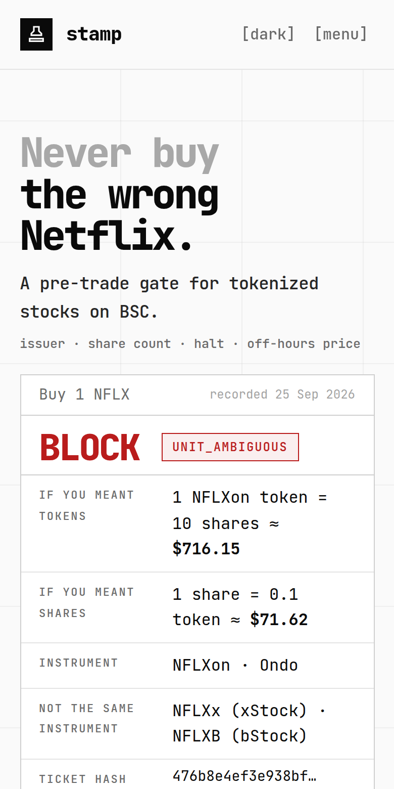
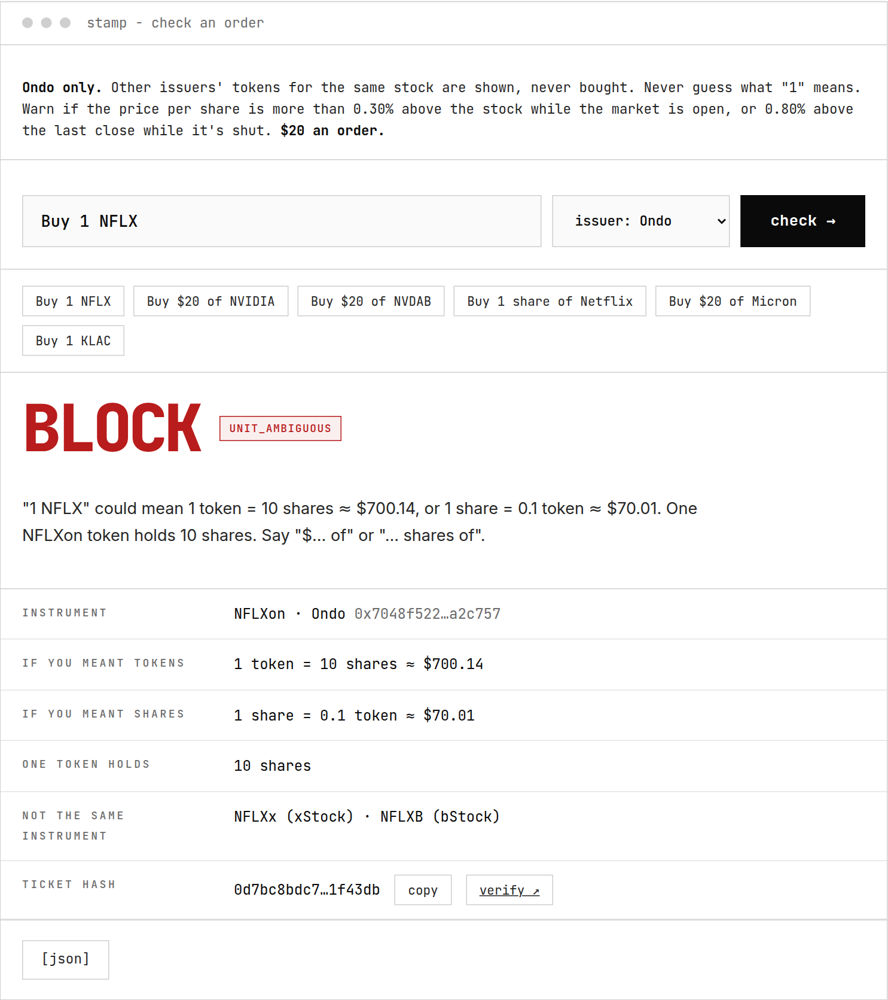

# Stamp

**A pre-trade gate for tokenized US stocks on BSC.** *Your agent can't buy the wrong Netflix.*

Ondo's Netflix token (`NFLXon`) is ten shares. bStock's (`NFLXB`) is one. xStock's own data
disagreed with itself about `NFLXx`: one Binance endpoint said 1 share, the other said 10.
Stamp will not guess, and nothing gets signed until the issuer, the share count, the halt,
and the off-hours price all pass.

Stamp checks an order **before** anything is signed and returns a hashed ticket:

```
BLOCK · UNIT_AMBIGUOUS
"1 NFLX" could mean 1 token = 10 shares ≈ $716.15, or 1 share = 0.1 token ≈ $71.62.
One NFLXon token holds 10 shares. Say "$… of" or "… shares of".
Not the same instrument: NFLXx (xStock), NFLXB (bStock).
hash 476b8e4ef3e9…   (recorded 25 Sep 2026; npm run replay recomputes it)
```

It checks four things in fixed code, in order: **issuer** (never switched), **share count**
(the multiplier is never assumed to be 1), **halt state** (a corporate action blocks) and
**price** (at most 0.30% over the stock while the market is open, 0.80% over the last close
while it's shut). No LLM decides the verdict.
The guarantee covers **orders that ask Stamp first**: Stamp does not sit inside Binance's
wallet or signer. For those orders, a quote is only requested after an `ALLOW`, the quote and
transaction are checked against that ticket, and you sign in your own Binance Wallet. Agents
get the same ticket over HTTP, over MCP ([`agent/`](agent/README.md)), or in front of Binance's
Agentic Wallet ([below](#with-the-binance-agentic-wallet)); a paid x402 route is wired and
waits on Binance's B402 merchant approval.

**Live:** https://stamp-iizn.onrender.com ([check](https://stamp-iizn.onrender.com/check/) ·
[proof](https://stamp-iizn.onrender.com/proof/) · [docs](https://stamp-iizn.onrender.com/docs/)).
It runs on a free host that a ping every 10 minutes keeps awake.

<p>
  
  
</p>

> **Demo video:** _not recorded yet - the link goes here._
> **Live mainnet fill:** _not yet. The Frankfurt review reached `APPROVAL_REQUIRED` with matching
> approve calldata; the first ≤ $20 fill and its BscScan link go here._
>
> **Status (2026-10-05).** Working and deployed: the verdict engine, the Binance data client,
> the free API with replay and verify, execution tickets (SWAP and RFQ) with a Wallet API
> balance check, Binance Wallet in the browser (Binance Wallet only; no other wallet is ever
> picked), standing orders (one per wallet, re-checked every 10 minutes), and the multi-page
> site with docs (light and dark). Built and tested, not yet run live: the
> Agent Studio agent (MCP tools work locally; the paid `/x402` route waits on B402 merchant
> approval) and the Agentic Wallet path (tested against a scripted `baw`; the first live swap
> has to run on a signed-in wallet outside the US).
> **Execution, by region:** from Render in Frankfurt the Binance Trading API quotes, approves
> and builds the swap. A live review reached `APPROVAL_REQUIRED`, and Binance's approve calldata
> matched Stamp's byte for byte. From US IP addresses the same API answers **`40304` inside an
> HTTP 200**, for tokenized stocks and for WBNB alike. So don't demo execution from GitHub
> Actions or a US laptop. Decisions use public endpoints and work everywhere.
> Submission drafts and the demo script: [`docs/SUBMISSION.md`](docs/SUBMISSION.md).
> Design: [`docs/ARCHITECTURE.md`](docs/ARCHITECTURE.md) · reasoning: [`docs/DECISIONS.md`](docs/DECISIONS.md) ·
> live API findings: [`docs/API-NOTES.md`](docs/API-NOTES.md) · deploy: [`docs/DEPLOY.md`](docs/DEPLOY.md).
> Built for the [BNB Hack: Tokenized Stocks Edition](https://www.bnbchain.org/en/hackathons/tokenized-stocks).

## With the Binance Agentic Wallet

An agent that trades through the [Agentic Wallet](https://developers.binance.com/en/docs/products/agentic-wallet/welcome)
(`baw`) can put Stamp in front of every tokenized-stock buy:

```bash
npm i -g @binance/agentic-wallet && baw auth signin      # confirm in the Binance App
npm run agentic -- "Buy \$20 of NVIDIA" --dry-run          # decision + checked quote, no swap
npm run agentic -- "Buy \$20 of NVIDIA"                    # type "yes" → swap → fill verified on BSC
```

Anything but ALLOW stops before `baw` is called. The Agentic Wallet builds and signs the swap
itself, so Stamp checks what it can see: the quote before (token, dollars, price, age) and the
BSC receipt after. The receipt must show the ticket's token arriving, no sibling issuer's
token, and a price within 0.50% of the decision. That gives three hashed tickets: decision,
execution and fill. [`skills/stamp-gate/SKILL.md`](skills/stamp-gate/SKILL.md) is the same rule
as a skill that sits next to Binance's `binance-agentic-wallet` skill.

## Try it live - no key needed



On the site, [/check](https://stamp-iizn.onrender.com/check/) runs any order against live
Binance data. From a terminal:

```bash
npm ci
npm run stamp -- "Buy 1 NFLX"                 # BLOCK: 1 token = 10 shares
npm run stamp -- "Buy \$20 of NVIDIA"         # ALLOW NVDAon; NVDAx and NVDAB are not the same instrument
npm run stamp -- "Buy \$20 of Micron" --issuer xstock   # BLOCK when MUx is far from the stock
```

## Run it (judges) - no key needed

```bash
git clone https://github.com/Ritapossible/Stamp && cd Stamp
npm ci
npm test          # engine, sources, API and agent tests, offline
npm run replay    # recomputes every recorded ticket and checks every hash
```

Expected: one line per ticket, then `621 tickets recomputed · all hashes match`: one test case
per rule, plus eight real captures - Friday 25 Sep 2026 (premarket, the last regular print, the
20:00 close pause, postmarket), the weekend (Saturday 16:00 and Sunday 23:30 UTC, when tokens
trade and the stock doesn't) and Monday 28 Sep (premarket and the last regular print). For
example:

```
ok     golden                  Buy 1 NFLX                  NFLXon    BLOCK  UNIT_AMBIGUOUS                                   476b8e4ef3e9
ok     golden                  Buy $20 of NFLXx            NFLXx     BLOCK  MULTIPLIER_CONFLICT                              bafe687f7356
ok     2026-09-25-premarket    Buy $20 of MUx              MUx       BLOCK  PRICE_IMPLAUSIBLE           -1025 bps            1bc98d447859
ok     2026-09-25-2000-close…  Buy $20 of AAPLon           AAPLon    BLOCK  MARKET_HALTED                                    1cf56aed85ec
```

Run the free API locally with `npm run serve`, then:

```bash
curl -s -X POST localhost:8787/v1/tickets -H 'content-type: application/json' \
  -d '{"intent":"Buy 1 share of Netflix"}'
curl -s localhost:8787/v1/tickets/<hash> > stored.json   # the ticket plus the inputs it was decided from
curl -s -X POST localhost:8787/v1/verify -H 'content-type: application/json' --data @stored.json   # matches: true
```

## What Stamp is honest about

- The Agentic Wallet and Trading API don't know about Stamp tickets. A caller that skips
  Stamp can still trade. Stamp's guarantee covers flows that go through it.
- For bStocks, Binance's status API returns no market session and no stock reference price.
  Stamp takes the session from the venue-level status and the reference from a same-ticker
  sibling or its own snapshot, and says so on the ticket.
- v1 is buy-only, spot-only, BSC-only, capped at $20 per order ($50 a day for standing
  orders), and a person signs every fill.
- The Agentic Wallet builds and signs its own swap, so on that path Stamp checks the quote
  before and the BSC receipt after, not the transaction itself. Binance documents it for bStock
  and Ondo tokens, so xStock orders stop before `baw`.
- Binance returned SWAP mode, not the RFQ its docs describe, for tokenized stocks from
  Frankfurt. Stamp checks SWAP by simulation and balance changes. The RFQ path is built and
  tested but has not been seen live.
- The full list is on the site: [/docs/limits](https://stamp-iizn.onrender.com/docs/limits/).

## Prior art

- [bozBasket](https://github.com/elaris-xyz/bozBasket) (Solana, Stocklana) defers a recurring
  basket buy on Pyth freshness, confidence, venue divergence, depth and session.
- [PixStock](https://github.com/PixStock/pixstock) (Solana, Stocklana) is an air-gapped phone
  signer that refuses an order more than 1% from a signed Pyth price.
- Binance's [`binance-tokenized-securities-info`](https://www.binance.com/en/skills/detail/binance-web3/binance-tokenized-securities-info)
  skill gives an agent the status codes, multipliers and prices as data and prose. The agent
  that wants the fill still decides.

The two Solana projects gate on price; the skill doesn't gate at all. None of them, as their
READMEs describe it, treats *which issuer's product* or *how many
shares one token holds* as a blocking check, and on BSC those are the two that cost a buyer 10×
or the wrong legal product. Stamp blocks on all four, issuer, share count, halt and off-hours
price, and hashes the answer.

## Layout

```
packages/engine   pure verdict engine (no I/O): decision, execution and fill tickets
packages/sources  Binance RWA client, issuer adapters, snapshots, Trading API, baw wrapper, BSC reads
packages/api      HTTP API, ticket store, standing order, the server for the site
apps/web          the site: one HTML page per route, plus /docs
agent/            BNB Agent Studio project (bag init): MCP tools, paid /x402 via B402, ERC-8004
scripts/          CLI (stamp), replay, snapshotter, the Agentic Wallet flow (agentic)
skills/           stamp-gate: the rule as an agent skill next to binance-agentic-wallet
fixtures/         recorded API payloads and golden cases
docs/             architecture, decisions, API notes, plan, deploy
```

## License

MIT. See [`LICENSE`](LICENSE).
