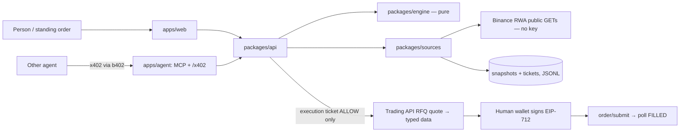

# Stamp — Architecture

Status: design frozen for v1 on 2026-09-25. Changes go through `docs/DECISIONS.md`.

## 1. Problem

A tokenized stock on BSC is not a share. There are three reasons.

1. **Issuer.** One US ticker exists as up to three separate legal products on BSC: Ondo
   (`NVDAon`), xStock (`NVDAx`) and bStock (`NVDAB`). On 2026-09-25, **118 BSC tickers** had
   more than one issuer. An agent asked to "buy NVIDIA" has to pick one, and a cheaper quote
   on another issuer is not the same instrument.
2. **Share count.** Each token represents `sharesMultiplier` shares. Dividends and splits
   change the multiplier and leave no wallet transaction. `NFLXon` has multiplier **10**: the
   token is ~$716 while NFLX is ~$72. `KLACon` is ~10, `CVNAon` and `NOWon` are 5, `CRWDon` is
   4. "Buy 1 share of Netflix" done naively buys 10.
3. **Session and halt.** Tokens trade 24/7, but the listing does not. During the weekend,
   overnight, or a corporate-action halt, the token price is not backed by a live print.
   Binance's own docs call ~±0.1% noise. Anything well above the last official close is a
   premium you pay.

Binance's `binance-tokenized-securities-info` skill documents the formula and the halt codes.
But it is prose, and the model that wants the fill is the same model that decides whether
the check passed. Stamp turns those rules into code that returns a hashed verdict.

## 2. Claim

> Stamp will not prepare a signature unless the issuer, share count, halt state and session
> premium all pass. It proves each decision with a hash anyone can recompute. Other agents
> pay for that answer over x402.

The honest limit, which goes in the README as well: the Agentic Wallet and Trading API do
not verify Stamp tickets. A caller that skips Stamp can still trade. Stamp's guarantee
covers the flows that go through it: the confirm screen is built only from an `ALLOW`
execution ticket, and the typed data being signed is checked against that ticket.

## 3. System



The engine is pure: data in, ticket out. Everything that does I/O lives in `sources` or
`api`. This split lets `npm test` and `npm run replay` run with no network and no key.

### Deployables

| Unit | Runs where | Needs a key |
|---|---|---|
| `packages/api` + snapshot cron | one small Node host (Fly/Render/Railway) | Trading API key for the live execution path only |
| `apps/web` | static host, or served by the API | no |
| `apps/agent` | `bag dev` locally plus a public tunnel, or Studio runtime (testnet credits) | agent wallet + b402 key |

## 4. Packages

### 4.1 `packages/engine` (pure, no I/O, no `number` for money)

| File | Responsibility |
|---|---|
| `types.ts` | All domain types and the `ReasonCode` union. |
| `decimal.ts` | `decimal.js` instance (precision 40, ROUND_HALF_EVEN) and helpers: `parseDec(str)` rejects `""`, `NaN` and exponents; `fmt(dec, dp)`. |
| `policy.ts` | `Policy` type, defaults, `validatePolicy`, `policyHash`. |
| `intent.ts` | Deterministic parser: `"Buy $20 of NVIDIA"` → `{side, unit:"usd", amount:"20", query:"NVIDIA"}`. Grammar, not an LLM. Units: `usd`, `shares`, `tokens`, or `ambiguous` (bare number). |
| `issuer.ts` | Resolves a query to candidates on chain 56. Picks by `policy.issuer`. Emits `rejected[]` with `NEVER_SWITCH`. |
| `unit.ts` | `tokens = usd / tokenPrice`, `shares = tokens × multiplier`, `tokens = shares / multiplier`. Ambiguity detection. |
| `session.ts` | Maps API status plus the NY clock (IANA `America/New_York`, DST-aware) to a `Session`. Produces `SESSION_DISAGREEMENT`. |
| `reference.ts` | Picks a reference price: live `stockInfo.price` → sibling's live price for the same ticker → snapshot `lastOfficialClose` → missing. |
| `premium.ts` | `economic = tokenPrice / multiplier`; `premiumBps = round((economic − ref) / ref × 10000)` (integer); `overpayUsd`. |
| `verdict.ts` | **The only place a verdict is made.** Runs the check table (§6) in order. |
| `execution.ts` | Makes an execution ticket from a decision ticket plus a quote plus decoded typed data (§7). |
| `hash.ts` | `canonicalJson`, `sha256Hex`, `ticketHash(ticket)` (drops `narration` and `hash`). |
| `narrate.ts` | Template sentences from ticket fields. Runs after the verdict and is not hashed. |

### 4.2 `packages/sources`

| File | Responsibility |
|---|---|
| `rwa.ts` | Typed client for the five public RWA GETs (§5). Timeouts at 5 s, one retry on `data: null`, raw payload kept for fixtures. Records latency per call for `DEVEX.md`. |
| `classify.ts` | Builds the `Instrument` universe from the list dump. The key is `(chainId, contractAddress)`. Issuer comes from `type` (1→ondo, 2→xstock, 3→bstock, else unsupported), **never parsed from the symbol**. The suffix is a display hint only (`MUB` is Micron, not a bond ETF). |
| `adapters.ts` | Raw dynamic → `MarketView` (§5.2). One adapter for all three issuers, because Binance returns one shape and only which fields are filled differs. It copies values through and never fills a gap. Non-string prices are rejected (JSON numbers have lost precision). |
| `capture.ts` | Raw capture file → the exact `MarketInputs` the engine saw (used by replay). |
| `market.ts` | `LiveMarket.forIntent`: cached universe (5 min), venue status, and the dynamic payload of every same-ticker instrument, all fetched in parallel. |
| `snapshots.ts` | Reads the snapshot JSONL written by `scripts/snapshot.ts`. `lastOfficialClose(ticker, asOf)` is the last stock price recorded while the venue said `regular` — the final ~10 minutes of the session, not the closing auction, and labelled as such. |
| `wallet.ts` | The `StockWallet` interface (§7) plus `FakeWallet` for tests. |
| `wallet-trading-api.ts` | Live RFQ path via the Binance Trading API (HMAC auth). |
| `wallet-baw.ts` | Optional adapter over the Agentic Wallet `baw` CLI, used if Day-9 testing shows it can quote tokenized stocks (see PLAN). |

### 4.3 `packages/api` (Hono)

| File | Responsibility |
|---|---|
| `server.ts` | Routes (§8). The same body validation (zod) is used by HTTP and MCP. |
| `tickets.ts` | Append-only JSONL store, indexed by hash. `GET /v1/tickets/:hash` re-hashes the stored ticket on read and returns 500 if it drifts. |
| `standing.ts` | The single standing order state machine (§9). The daily cap is computed from `FILLED` tickets. |
| `clock.ts` | Real clock, or a fixture clock when `asOf` is supplied (replay only). |

### 4.4 `apps/web`

One screen, no charts, no component library. See §10.

### 4.5 `apps/agent`

This is the BNB Agent Studio project scaffolded by `bag init`. It exposes one MCP tool,
`stamp.ticket`, and one paid route, `POST /x402`. Both call `packages/api` over HTTP or
import the engine directly. **Neither reimplements a check.** The price is a config
constant.

## 5. External data

### 5.1 RWA endpoints (public; no key; verified live 2026-09-25)

Headers on every call: `User-Agent: binance-web3/1.1 (Skill)`, `Accept-Encoding: identity`.
The base is `https://www.binance.com/bapi/defi/{v1|v2}/public/wallet-direct/buw/wallet/market/token/rwa`.

| Name | Path | Used for |
|---|---|---|
| list | `v1 …/stock/detail/list/ai` | The universe: `chainId, contractAddress, symbol, ticker, type, assetType, multiplier, d` |
| meta | `v1 …/meta/ai?chainId=56&contractAddress=` | `name` (e.g. "Netflix (Ondo)", "NVIDIA xStock"), attestation PDFs |
| market | `v1 …/market/status/ai` | Venue-level `marketStatus`, `nextOpen/Close`, `offhours` |
| asset status | `v1 …/asset/market/status/ai?chainId=&contractAddress=` | `openState, marketStatus, reasonCode, reasonMsg` |
| dynamic | `v2 …/dynamic/ai?chainId=&contractAddress=` | `tokenInfo.price`, `tokenInfo.sharesMultiplier`, `stockInfo.price`, `statusInfo`, `limitInfo` |

`dynamic.statusInfo` has the same shape as asset status. Use it and cut one call per ticket.
Keep the separate asset-status call only as a fallback.

### 5.2 Per-issuer adapter behavior (from the probe, `fixtures/probe-2026-09-25/`)

| Field | Ondo (type 1) | bStock (type 3) | xStock (type 2) |
|---|---|---|---|
| `tokenInfo.price` | present | present | present (seen `data:null` once) |
| `tokenInfo.sharesMultiplier` | present, matches list | present, matches list | present; **list says `"1"`, dynamic says `1.0009…`** |
| `statusInfo.marketStatus` | `premarket` etc. | `null` | `null` |
| `statusInfo.nextOpen/CloseTime` | present | `null` | `null` |
| `statusInfo.reasonCode` | `TRADING` | `TRADING` | `TRADING` |
| `stockInfo.price` | present (per ticker) | **`null`** | present (same value as Ondo) |
| `limitInfo` | `{maxAttestationCount, maxActiveNotionalValue}` | `null` | `null` |

Normalized into:

```ts
interface MarketView {
  instrument: Instrument;
  tokenPriceUsd: string | null;
  multiplier: string | null;          // from dynamic only
  listMultiplier: string | null;      // cross-check
  assetStatus: { openState: boolean | null; marketStatus: string | null;
                 reasonCode: string | null; reasonMsg: string | null } | null;
  venueStatus: { marketStatus: string; nextOpen: string | null; nextClose: string | null };
  sessionSource: "asset" | "venue";   // ondo → asset; bstock/xstock → venue
  liveStockPriceUsd: string | null;   // this instrument's stockInfo.price
  fetchedAt: string;
  raw: Record<string, unknown>;       // kept for fixtures, never hashed
}
```

### 5.3 Reference price resolution (`reference.ts`)

The reference is for the **underlying ticker**, not the token. For each call, in order:

1. If this instrument's `stockInfo.price` is non-null → `stockInfo`.
2. Otherwise, if any same-ticker sibling on chain 56 has a non-null `stockInfo.price` fetched
   within 60 s → `stockInfo-sibling` (the ticket records which sibling; order Ondo, xStock,
   bStock). This is how bStocks get a reference.
3. Otherwise, the snapshot store's last `regular`-session print for the ticker →
   `lastOfficialClose` (with its timestamp).
4. Otherwise → `missing` → `WARN NO_REFERENCE`.

A sibling's *token* price is never used as a reference. Only `stockInfo.price` counts.

### 5.4 Trading API (key required; live path only)

Base `https://web3.binance.com/build`, HMAC-SHA256 auth (`X-OC-APIKEY`, `X-OC-TIMESTAMP`,
`X-OC-SIGN`). The pre-hash is `timestamp + METHOD + path(including /build + query) + body`.

Tokenized stocks come back as `executionMode: "RFQ"`:

1. `GET /api/v1/dex/aggregator/quote` → `quoteId` (~30 s life), `vendorName`, amounts.
2. `GET /api/v1/dex/aggregator/approve-transaction?vendor=…` if the USDT allowance is short.
   This is a normal tx, and **it** can be checked with `POST /api/v1/dex/pre-transaction/simulate`.
3. `GET /api/v1/dex/aggregator/swap` → `rfq.typedDataToSign`, `rfq.orderId`.
4. The human signs `eth_signTypedData_v4` in their wallet.
5. `POST /api/v1/dex/aggregator/order/submit` with `userSignature, vendor, quoteId=rfq.orderId, requestId=uuid`.
6. `GET /api/v1/dex/aggregator/order/{orderId}` until `FILLED` or `FAILED`.

### 5.5 b402 (x402 facilitator, key required)

Binance's x402 facilitator is at the same base URL and uses the same auth: V2 *supported
configurations*, *verify* and *settle*, on `eip155:56`, with `eip3009` or `permit2`
stablecoin authorizations. The paid face uses b402 to verify and settle, so the payment
itself also runs on the Binance Web3 API, which counts toward the tie-break.

## 6. Decision check table (`verdict.ts`)

Checks run in order and stop at the first `BLOCK`. `WARN` codes pile up. The final verdict
is `BLOCK` if any check blocked, otherwise `WARN` if any warned, otherwise `ALLOW`.

| # | Check | Result |
|---|---|---|
| 1 | Parse intent. Unparseable → `UNPARSEABLE_INTENT`. | BLOCK |
| 2 | Resolve on chain 56: exact symbol, else company name → ticker (`aliases.ts`, no fuzzy matching), else ticker. Zero candidates or an unsupported `type` (4, 9, …) → `UNKNOWN_TOKEN`. The query is one instrument's symbol **and** another stock's ticker → `AMBIGUOUS_QUERY`. Several issuers and `policy.issuer = null` → `AMBIGUOUS_ISSUER` (options listed). The query names an issuer (`NVDAB`) that isn't `policy.issuer`, or the ticker has no version from `policy.issuer` → `ISSUER_NOT_ALLOWED`. Every non-chosen sibling goes into `rejected[]` with `NEVER_SWITCH`. | BLOCK |
| 3 | `data: null` after one retry, no asset status, the price is missing, or `reasonCode` is null or not a documented value → `INCOMPLETE_STATUS`. | BLOCK |
| 4 | Dynamic multiplier missing, unparseable or `<= 0` → `NO_MULTIPLIER`. | BLOCK |
| 5 | List and dynamic multipliers differ by ≥ 2× in either direction → `MULTIPLIER_CONFLICT` (a split-scale disagreement; live: `NFLXx` 1 vs 10). A smaller difference (relative > 1e-9) → `MULTIPLIER_DRIFT`: a WARN for Ondo/bStock, a note for xStock, whose list is known stale. | BLOCK / WARN / note |
| 6 | Unit: `unit = ambiguous` (e.g. "buy 1 NFLX") and multiplier ≠ 1 → `UNIT_AMBIGUOUS`. The ticket shows both readings: "1 token = 10 shares ≈ $716" and "1 share = 0.1 token ≈ $72". | BLOCK |
| 7 | Halt: `reasonCode ∈ {ASSET_PAUSED, ASSET_LIMITED}` with a corporate-action `reasonMsg` (`cash_dividend, stock_dividend, stock_split, merger, acquisition, spinoff, corporate action, earnings, maintenance`) → `HALTED_CORPORATE_ACTION`. `ASSET_PAUSED`/`ASSET_LIMITED` with any other message → `MARKET_HALTED`. `reasonCode ∈ {MARKET_PAUSED, MARKET_MAINTENANCE, UNSUPPORTED}` or `marketStatus = pause` (asset or venue) → `MARKET_HALTED`. Asset `openState = false` → `VENUE_CLOSED`. | BLOCK |
| 8 | Session. Take it from asset status (Ondo) or venue status (bStock/xStock). Map `regular→regular`, `premarket|postmarket→extended`, `overnight|closed→closed`, anything else `unknown`. If the NY clock and the API disagree about cash-open → `SESSION_DISAGREEMENT`. For `unknown` → `SESSION_UNKNOWN`. | WARN |
| 9 | Reference missing (§5.3) → `NO_REFERENCE`. Premium checks are skipped. | WARN |
| 10 | `|premiumBps| > policy.implausibleAbsBps` (500) → `PRICE_IMPLAUSIBLE`. | BLOCK |
| 11 | Session is `closed`/`extended` and `premiumBps > policy.maxClosedPremiumBps` (80) → `SESSION_RICH`, and fill in `overpayUsd`. | WARN |
| 12 | Session is `regular` and `premiumBps > policy.maxRegularPremiumBps` (30) → `SESSION_RICH`. | WARN |
| 13 | Discount beyond the noise band (`premiumBps < −noiseBandBps`) → note `THIN_BOOK`. Size is **never** increased. | note |

Tickets carry `reasons` (the WARN codes, then the BLOCK code if any, or `["OK"]`) and
`notes` (informational: `THIN_BOOK`, xStock `MULTIPLIER_DRIFT`). `overpayUsd` is filled
whenever the premium is positive: `notional × (economic − reference) / economic`.
| 14 | Notional over `maxOrderUsd`, or today's `FILLED` sum plus notional over `maxDayUsd` → `OVER_CAP`. | BLOCK |
| 15 | Otherwise → `OK`. | ALLOW |

Unit lines are always on the ticket, even for `ALLOW`:

```
token units     = notionalUsd / tokenPrice
economic shares = token units × multiplier
economic price  = tokenPrice / multiplier      (Binance formula, cited on the ticket)
```

## 7. Execution ticket (`execution.ts`)

This step runs only after a decision `ALLOW`, and only when the human presses **Review**.

| # | Check | Result |
|---|---|---|
| E1 | The decision ticket re-hashes to the same value it was stored under. | else BLOCK `TICKET_TAMPERED` |
| E2 | The decision was made ≤ 120 s ago. Otherwise re-run the decision. | else BLOCK `DECISION_STALE` |
| E3 | Quote `executionMode` is `RFQ` or `SWAP`. Record which. | — |
| E4 | Quote age ≤ `policy.quoteTtlSec` (25 s, which leaves room for the ~30 s API expiry). | else BLOCK `QUOTE_STALE` |
| E5 | Quoted `toTokenAddress` equals the decision's `chosen.contractAddress`. | else BLOCK `ISSUER_MISMATCH` |
| E6 | Effective price from the quote (`amountIn / amountOut`) versus the decision's `tokenPriceUsd` stays within `maxSlippageBps` (50). | else BLOCK `SLIPPAGE` |
| E7 | RFQ: decode `rfq.typedDataToSign`. The token, amount and recipient must match the ticket, and the recipient must be the user's address. SWAP: `pre-transaction/simulate` must pass. | else BLOCK `TYPED_DATA_MISMATCH` / `SIMULATION_FAILED` |
| E8 | If an approval is needed, simulate the approve tx. | else BLOCK `SIMULATION_FAILED` |

The execution ticket stores `typedDataHash = sha256(canonicalJson(typedDataToSign))`. The web
confirm screen shows the ticket and hands exactly that typed data to the wallet. The human
signing is the confirmation.

```ts
interface StockWallet {
  quote(i: { chainId: 56; toToken: string; fromToken: string; amountIn: string; user: string })
    : Promise<Quote>;                               // never executes
  prepare(quoteId: string, slippageBps: number)
    : Promise<{ mode: "RFQ" | "SWAP"; typedData?: unknown; tx?: unknown; orderId?: string }>;
  simulate(tx: unknown): Promise<{ ok: boolean; error: string | null }>;
  submit(i: { orderId: string; signature: string }): Promise<{ orderId: string }>; // after human signs
  status(orderId: string): Promise<"PENDING" | "FILLED" | "FAILED">;
}
```

## 8. Types (abridged; the source of truth is `packages/engine/src/types.ts`)

```ts
type Issuer = "ondo" | "bstock" | "xstock";
type Verdict = "ALLOW" | "WARN" | "BLOCK";
type Session = "regular" | "extended" | "closed" | "unknown";

type ReasonCode =
  | "UNPARSEABLE_INTENT" | "UNKNOWN_TOKEN" | "AMBIGUOUS_QUERY" | "AMBIGUOUS_ISSUER"
  | "ISSUER_NOT_ALLOWED" | "NEVER_SWITCH"
  | "INCOMPLETE_STATUS" | "NO_MULTIPLIER" | "MULTIPLIER_CONFLICT" | "MULTIPLIER_DRIFT"
  | "UNIT_AMBIGUOUS" | "HALTED_CORPORATE_ACTION" | "MARKET_HALTED" | "VENUE_CLOSED"
  | "SESSION_DISAGREEMENT" | "SESSION_UNKNOWN" | "NO_REFERENCE" | "PRICE_IMPLAUSIBLE"
  | "SESSION_RICH" | "THIN_BOOK" | "OVER_CAP" | "OK"
  // execution
  | "TICKET_TAMPERED" | "DECISION_STALE" | "QUOTE_STALE" | "ISSUER_MISMATCH"
  | "SLIPPAGE" | "TYPED_DATA_MISMATCH" | "SIMULATION_FAILED";

interface Policy {
  version: 1;
  issuer: Issuer | null;            // demo default "ondo"; null = the order must name one
  neverSwitchIssuer: true;          // literal type
  noiseBandBps: 10;
  maxRegularPremiumBps: 30;
  maxClosedPremiumBps: 80;
  implausibleAbsBps: 500;
  maxSlippageBps: 50;
  quoteTtlSec: 25;
  maxOrderUsd: string;              // "20"
  maxDayUsd: string;                // "50"
  blockCorporateActions: true;
}

interface DecisionTicket {
  kind: "decision"; engineVersion: string; asOf: string; intentId: string;
  intent: { raw: string; side: "buy"; unit: "usd" | "shares" | "tokens" | "ambiguous"; amount: string; query: string };
  chosen: Instrument | null;
  rejected: Array<{ symbol: string; issuer: Issuer; contractAddress: string; reason: ReasonCode }>;
  session: Session; sessionSource: "asset" | "venue" | null;
  marketStatus: string | null; reasonCode: string | null; reasonMsg: string | null;
  multiplier: string | null; listMultiplier: string | null;
  tokenPriceUsd: string | null; economicPriceUsd: string | null;
  referenceUsd: string | null;
  referenceSource: "stockInfo" | "stockInfo-sibling" | "lastOfficialClose" | "missing";
  referenceAsOf: string | null; referenceSibling: string | null;
  premiumBps: number | null; overpayUsd: string | null;
  notionalUsd: string | null; tokenUnits: string | null; economicShares: string | null;
  verdict: Verdict; reasons: ReasonCode[];
  inputsHash: string;               // sha256 of the normalized MarketView set used
  policyHash: string;
  hash: string;                     // sha256(canonical ticket without hash + narration)
  narration: string;                // template; not hashed
}
```

## 9. Standing order (`standing.ts`)

There is one policy, one ticker and one USD amount.

```
PARKED ──(every 10 min)──► RECHECK
RECHECK ── decision WARN/BLOCK ──► PARKED   (ticket appended)
RECHECK ── decision ALLOW ──► READY        (notify: "ready to review")
READY ── human presses Review ──► QUOTED ──► execution ticket
   execution BLOCK ──► PARKED
   execution ALLOW ──► AWAITING_SIGNATURE ── human signs ──► SUBMITTED ──► FILLED | FAILED→PARKED
READY/AWAITING_SIGNATURE time out (quote TTL) ──► PARKED
```

The worker never holds a key. Every state change appends a ticket or event to JSONL, so
"last weekend" can be replayed on a Wednesday.

## 10. HTTP surface

Free (judges and web):

| Method | Path | Behavior |
|---|---|---|
| POST | `/v1/tickets` | `{ intent, policy, asOf? }` → decision ticket. `asOf` works only with the fixture clock. |
| GET | `/v1/tickets/:hash` | Stored ticket, re-hashed on read. |
| POST | `/v1/verify` | `{ ticket }` → recomputes the hash and, from recorded inputs, the verdict. |
| GET | `/v1/replay/last-weekend` | Recomputes from `fixtures/last-weekend/`. |
| POST | `/v1/execution` | `{ decisionHash, user }` → execution ticket plus typed data (live path, key on server). |
| POST | `/v1/execution/:hash/submit` | `{ signature }` → submits the RFQ order. |
| GET/POST | `/v1/standing` | Read or create the single standing order. |

Paid (agent face only): MCP tool `stamp.ticket` (same body as `POST /v1/tickets`), and
`POST /x402` using the b402 verify/settle flow at a fixed price of `"0.02"` USDT. **Payment
settles before the engine runs.**

## 11. Web screen

- Line 1: the policy in one sentence. "Ondo only. Never switch issuer. Park if the market is
  shut and the price is more than 0.80% above the last close. $20 per order, $50 per day."
- Input: `Buy $20 of NVIDIA`, with example chips: `Buy 1 NFLX` · `Buy $20 of NVDAB` · `Buy $20 of NVIDIA`.
- Ticket card: the verdict as one big word, the overpay in dollars, "You get X tokens = Y
  shares", the issuer, a "Not the same instrument" list of rejected siblings, the hash with a
  copy button, and a "verify" link.
- Below: "Last weekend", one row per ticker, replayed from fixtures.
- Standing-order pill: `PARKED` / `READY` / `AWAITING SIGNATURE` / `FILLED (tx link)`. It never
  says "bought" without an order id.

Plain language is used throughout: "shares", not "economic shares"; "Friday's close", not
"lastOfficialClose". The JSON sits behind a toggle.

## 12. Fixtures and tests

- `fixtures/probe-*/`: raw captures, never edited.
- `fixtures/golden/<case>/`: `inputs.json` (a MarketView set plus clock), `intent`, `policy` and
  `expected.json` (verdict, reasons, hash). `npm test` iterates over them.
- `fixtures/last-weekend/`: captures from Sat–Sun, one file per ticker per capture.
- `npm run replay` prints `symbol · verdict · premium · overpay · hash` and exits 1 if a hash drifts.

Required cases: every row of the §6 and §7 tables, plus these:

- `NFLXon` "buy 1 NFLX" → `UNIT_AMBIGUOUS`
- `NFLXon` "$20" → 0.0279 tokens = 0.279 shares
- `NVDA` with policy `ondo` → chooses `NVDAon`, rejects `NVDAB` and `NVDAx`
- `NVDAB` query with policy `ondo` → `NEVER_SWITCH`
- a bStock with the reference coming from its sibling
- xStock `data:null`
- DST boundary days (8 Mar and 1 Nov 2026)
- the same inputs twice → identical hash

## 13. Failure modes and responses

| Failure | Response |
|---|---|
| RWA endpoint 5xx or timeout | One retry, then `INCOMPLETE_STATUS`. Never fall back to a stale price. |
| `data: null` | One retry after 1 s, then `INCOMPLETE_STATUS`, plus a DEVEX raw-log line. |
| Snapshotter down over a weekend | `NO_REFERENCE` warnings, visible and honest. |
| Trading API key not issued | The judge path is unaffected. The live path shows "execution unavailable". |
| Quote expires during human review | `QUOTE_STALE` → re-quote button. |
| Agent Studio hosting is testnet-only | Run `bag dev` with a tunnel for the paid face, and note it in DEVEX. |

## 14. Security notes

- No private keys on the server. The Trading API and b402 secrets go in env vars only and
  are never logged.
- The ticket store is append-only, and hashes are re-checked on read.
- Input validation uses zod, with length limits on `intent`.
- Rate limiting on the free API is per IP (simple token bucket).
